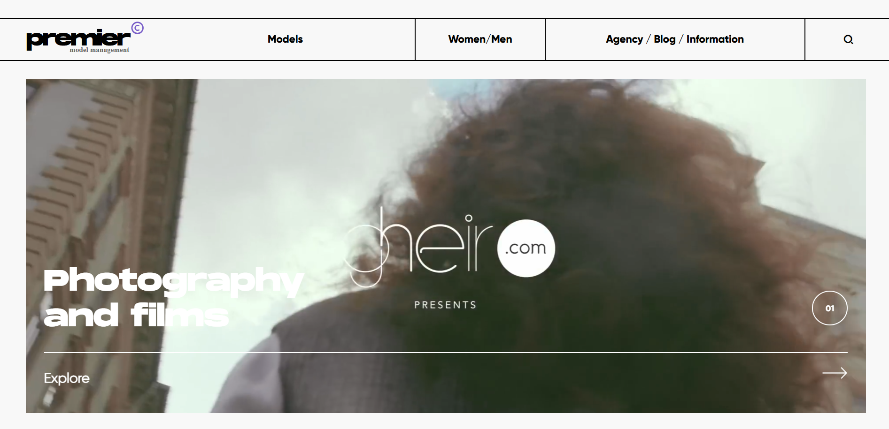

🌐 Premier Models Showcase

📌 Description:

Welcome to Premier Models Showcase, a visually stunning website inspired by the Behance design. This project highlights models from around the world in an elegant and responsive web layout.

📌 Features

Fully Responsive: The website is optimized for all devices, including mobile, tablet, and desktop.

Minimalist & Modern Design: Inspired by the provided Behance design to deliver a sleek, professional look.

HTML & CSS Powered: Built purely using HTML and CSS for a lightweight and fast experience.

Showcasing Global Models: A well-structured gallery that elegantly presents models from different parts of the world.

📂 Technologies Used

HTML5 - Markup structure for content.

CSS3 - Styling and layout for an appealing UI.

📸 Screenshots

🚀 Live Preview

If available, provide a live preview link here:

[Live Demo](https://aadi-si.github.io/ModelVerse/)